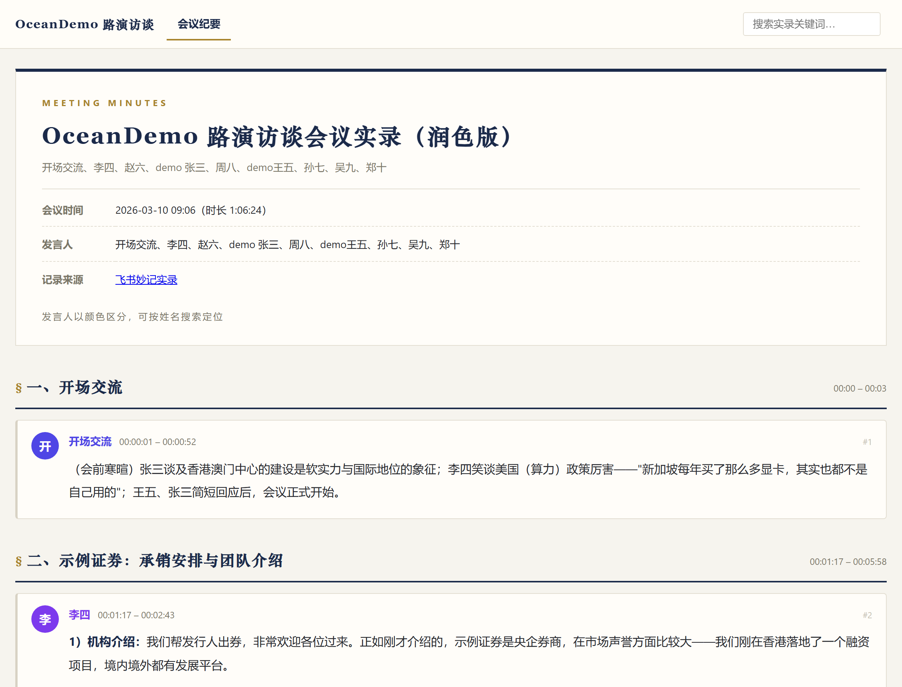
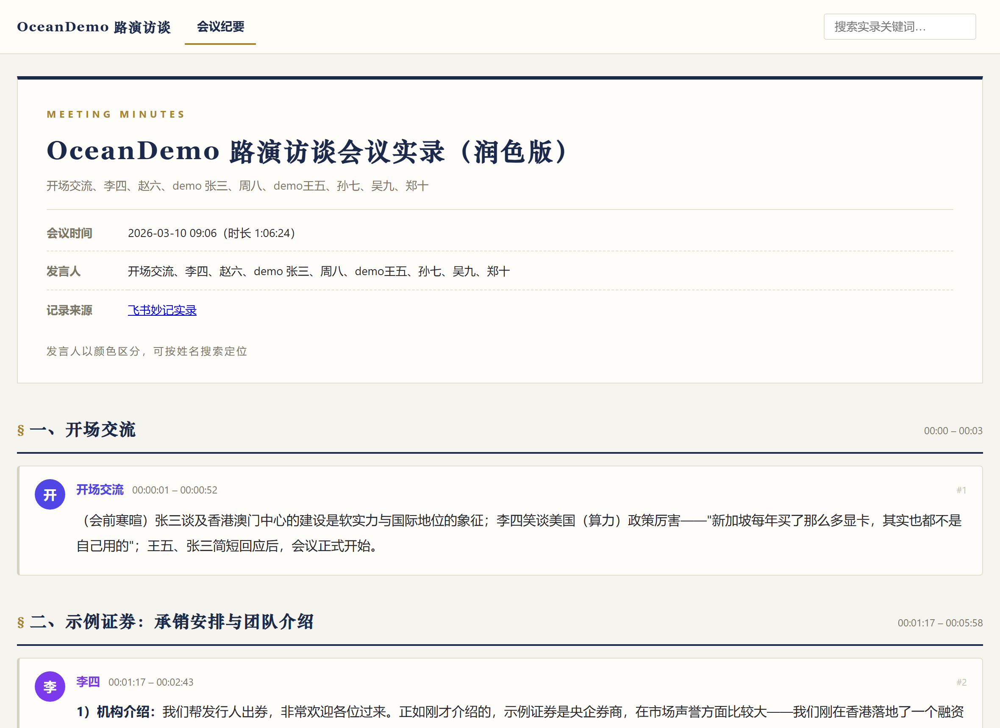
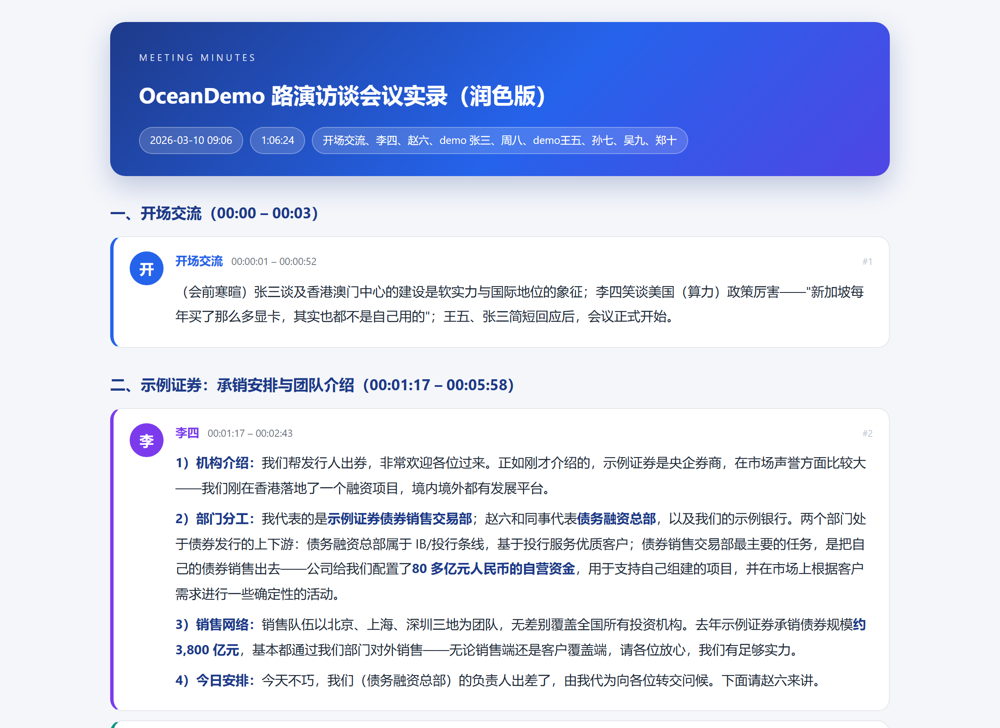
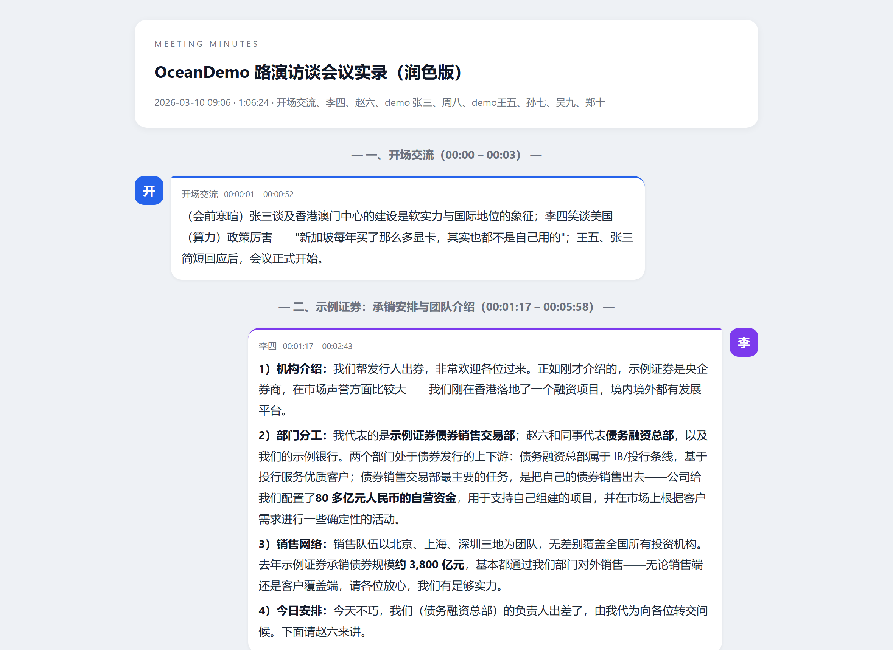
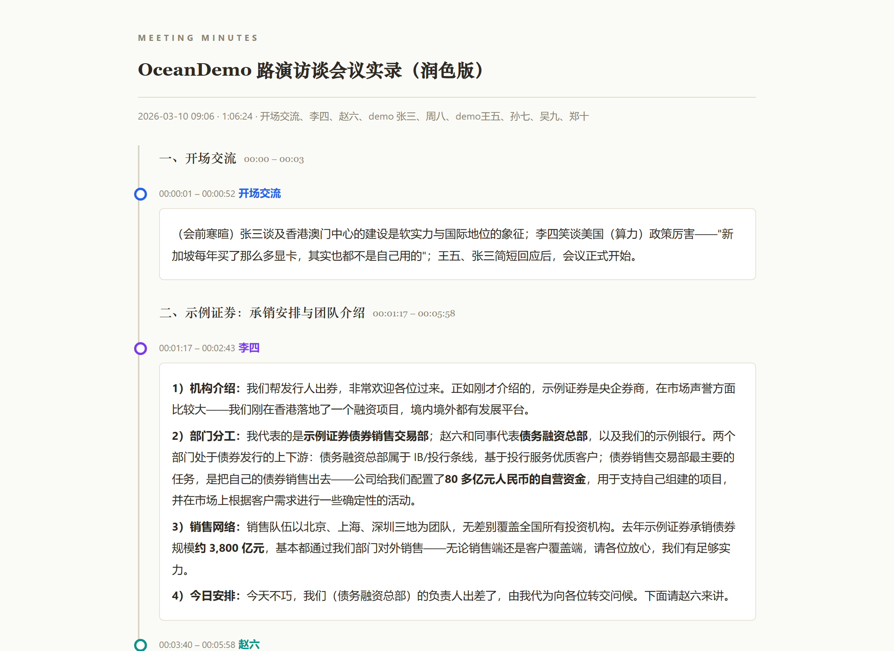
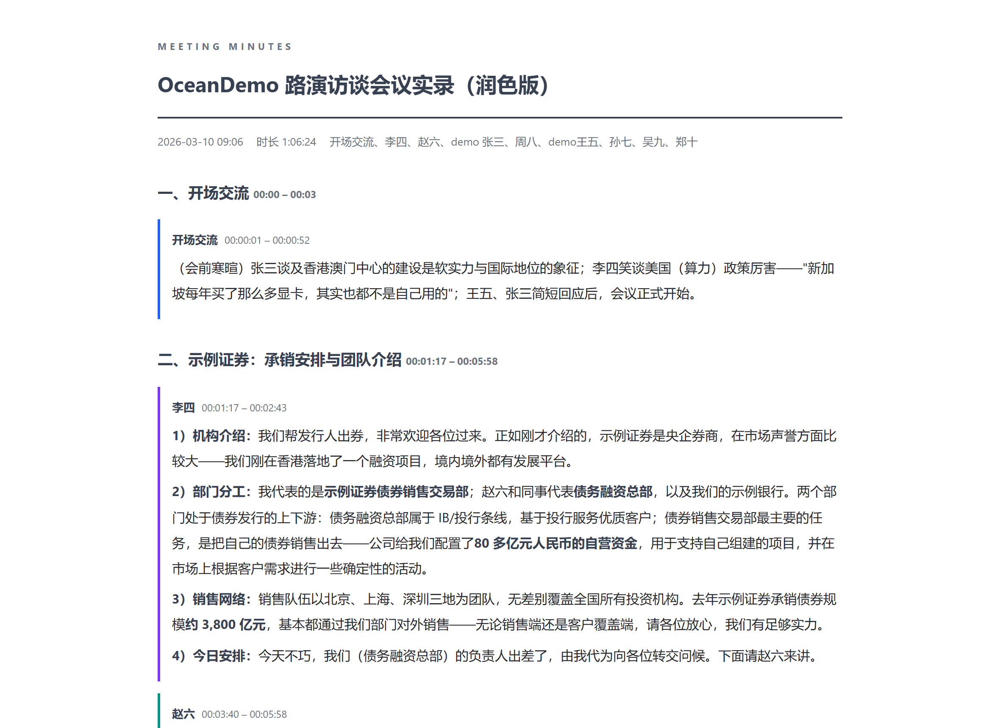
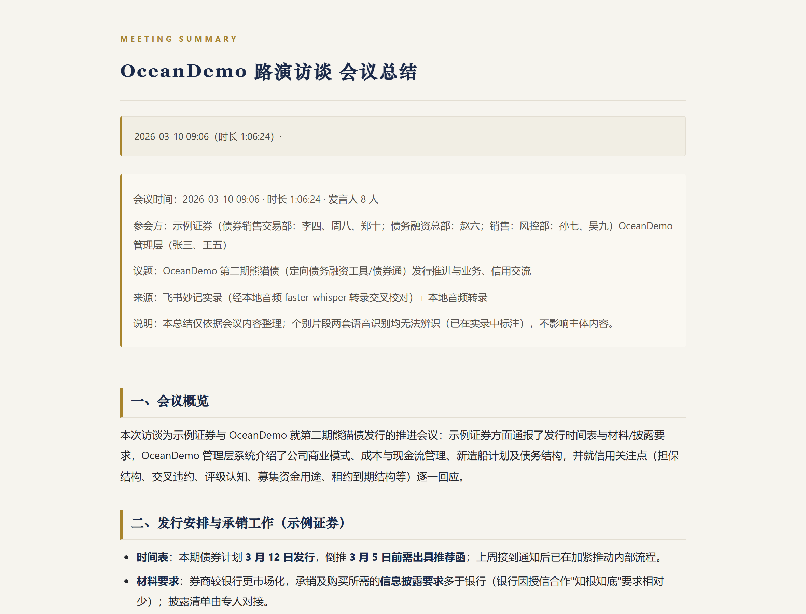

<div align="center">

# interview-report-kit

**会议/访谈实录 → 让人想读完的 HTML 报告**（飞书妙记 · 腾讯会议 · 本地文档 · 本地录音多源输入）

一次真实访谈的原始录音转写，经过爬取、双源交叉校正、LLM 润色、结构化总结、思维导图，
最终一键套上任意一套模板，变成可以直接外发的单文件网页报告。

[](https://www.python.org/)
[](LICENSE)
[](tests/)

</div>

---

## ✨ 演示效果

一次虚构路演访谈（1 小时 6 分 · 8 位发言人）跑完整条流水线的最终产出，`research-report` 版式、单文件 HTML：

| 📄 访谈纪要（53 个发言块 · 按发言人着色 · 可搜索） | 📄 会议总结（8 个主题章节 · 尾部内嵌思维导图） |
|:---:|:---:|
|  |  |

完整产物（含 markdown 中间稿与思维导图源文件）见 [examples/demo-interview/](examples/demo-interview/)。

---

## 🎨 五套模板，一键换装

同一次访谈的同一份 markdown，换一个 `--template` 参数就是另一种气质——

| `research-report` 研报风 | `modern-card` 现代卡片 |
|:---:|:---:|
|  |  |
| 藏青×鎏金、衬线标题、发言人彩色图例，机构外发首选 | 亮色渐变 Hero、圆角卡片，内部分享轻快愉悦 |

| `chat-bubble` 对话气泡 | `timeline` 时间轴 |
|:---:|:---:|
|  |  |
| IM 聊天感、左右气泡按发言人着色，轻松易读 | 垂直时间轴串联全场，快速定位每段发言 |

| `clean-doc` 简洁文档 | 总结版式（各 set 通用骨架） |
|:---:|:---:|
|  |  |
| 零 JS 纯文档、纸白灰调，打印归档最优 | 章节化总结 + 内嵌思维导图，支持打印为 PDF |

> 每套 set = 纪要版（发言块结构）+ 总结版（文档结构）成对搭配。模板是自包含 HTML，
> 复制一套目录改改样式就是你的专属模板，`doctor.py --check-template` 帮你把关。

## 🔀 流水线全景

```
妙记 URL ──① fetch_feishu.py──▶ minutes_raw.json ──② build_transcript.py──▶ 会议实录.md
腾讯 /cw/ ──①′ fetch_tencent.py──▶ minutes_raw.json（同上合流）
本地文档 ──①″ extract_text.py + agent 结构化──▶ minutes_raw.json（同上合流）
仅录音 ──③′ asr_diarize.py + 对话式标记──▶ minutes_raw.json（同上合流）
仅录音快速 ──③ asr.py──▶ transcript.txt ──agent──▶ 会议总结.md（单产物）
                                                                │
本地音频 ──③ asr.py──────────▶ transcript.txt ──④ 校正──▶ 会议实录（修正）.md ──⑤ 润色 ──▶ ✨
                                                                │
                              ⑥ 会议总结.md ◀── LLM 按 pipeline.md 执行 ──⑦ 思维导图.mmd/.png
                                                                │
              ⑧ render.py ──任选模板──▶ 📄 访谈纪要.html  +  📄 会议总结.html
```

- **① 爬取**：Playwright 持久登录态（首跑扫码一次，之后免登），直调妙记内部接口，段落级发言人归属
- **③ 转录**：自带 ffmpeg + faster-whisper 流水线（HF 源不通自动切镜像、断点续跑）
- **④ 校正**：LLM 双源比对生成规则 → 脚本确定性执行，命中数/段落数硬校验，**改了什么全部可审计**
- **⑤⑥ 润色与总结**：合并同一发言人连续发言为时间块、书面化、段内逻辑分点、关键数字加粗——产物全是**可手工编辑的 markdown**
- **⑦ 导图**：Mermaid mindmap 源文件 + 渲染 PNG
- **⑧ 渲染**：`--mindmap` 一并嵌入；搜索高亮、发言人配色、打印样式模板内建

## 🚀 快速开始

```bash
pip install -r requirements.txt
playwright install chromium          # 爬取用；另需系统安装 ffmpeg 与 Node + mmdc
python scripts/doctor.py             # 环境自检，全 ✅ 再继续

python scripts/fetch_feishu.py <妙记URL>          # 首次弹浏览器扫码，登录态持久化
python scripts/build_transcript.py minutes_raw.json
python scripts/asr.py <本地音频>                    # 可选；无音频跳过校正环节
python scripts/fetch_tencent.py "<腾讯会议/cw/分享URL>"   # 公开分享免登录
python scripts/extract_text.py 会议纪要.docx              # 本地文档→纯文本，agent 再结构化
python scripts/asr_diarize.py 会议录音.m4a                # 仅录音+分发言人（需 requirements-diarize.txt）
# ④⑤⑥⑦ 由 LLM 按 reference/pipeline.md 执行（也可全程手工编辑 markdown）
python scripts/render.py 会议实录（修正）.md --template research-report/minutes --out 访谈纪要.html
python scripts/render.py 会议总结.md --template research-report/summary --mindmap 思维导图.png --out 会议总结.html
```

`render.py` 可以脱离流水线单独使用——任何 markdown + 任意模板，一条命令套壳出 HTML；
markdown 改了重跑一遍即可。`--list-templates` 查看全部模板。

完整示例产物见 [examples/demo-interview/](examples/demo-interview/)（虚构演示数据）。

## 📁 目录结构

```
├── SKILL.md                  # Agent 工作流入口（9 环节），也可作为人工操作手册
├── scripts/                  # 独立 CLI：doctor / fetch_feishu / fetch_tencent / extract_text / build_transcript / asr / asr_diarize / apply_corrections / render / speaker_check
├── reference/
│   ├── templates/            # 5 套模板 set（minutes + summary 成对）
│   ├── pipeline.md           # LLM 环节操作细则（校正/润色/总结/导图原则）
│   └── feishu-api.md / tencent-api.md   # 转写源接口手册 + 爬取失败手动兜底流程
├── tests/                    # 18 项 pytest（含 doctor↔render 占位符契约锁定）+ 演示数据夹具
├── docs/                     # 设计文档、实施计划与模板截图
└── examples/demo-interview/  # 演示示例：一次虚构路演访谈的全套产物
```

## 🔒 数据与隐私

`tests/fixtures/` 与 `examples/` 均为**虚构演示数据**（化名发言人、虚构发行人与示例链接）。
真实数据跑流水线时产物只落本机工作目录；飞书登录态（`.auth/`）已被 gitignore，永不入库。

## 📦 发布与安装目录同步

本仓库即 skill 源；本机 agent 使用前同步到技能目录（排除登录态与运行产物）：

```bash
robocopy "E:\LLMproject\Github\interview-report-kit" "C:\Users\bunny\.agents\skills\interview-report-kit" /MIR /XD .git .auth __pycache__ .pytest_cache .playwright-mcp runs asr_runs /XF "*.pyc"
```

同步后跑 `python <skill>/scripts/doctor.py` 验证。版本：v1.1.0（多源输入 P1+P2）、v1.2.0（+分离转录）。

## 📄 License

[MIT](LICENSE)
