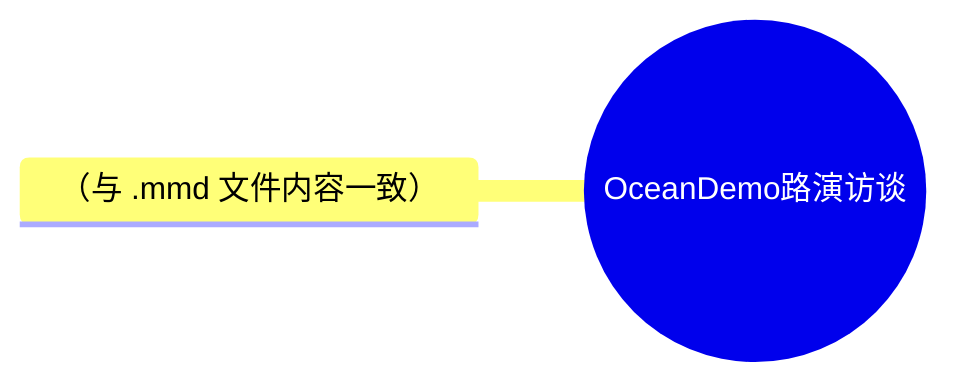

# OceanDemo 路演访谈：实录爬取 + ASR 交叉修正 + 总结/思维导图 实施计划

> **For agentic workers:** REQUIRED SUB-SKILL: Use superpowers:executing-plans to implement this plan task-by-task. Steps use checkbox (`- [ ]`) syntax for tracking.
> **注意**：浏览器相关任务（Task 3/4）必须由主会话用 Playwright MCP 执行，禁止派发子代理。本工作区不是 git 仓库，所有"Commit"步骤替换为"验证检查点"。

**Goal:** 从飞书妙记爬取带发言人信息的会议实录，用本地音频 ASR 交叉修正后，生成 会议实录.md、会议实录（修正）.md、会议总结.md（尾部附 Mermaid 思维导图 PNG）。

**Architecture:** 四阶段流水线。ASR（耗时 10~30 分钟）后台先行启动，与浏览器爬取并行；实录爬取优先重放页面内部转录接口、DOM 滚动兜底；修正与总结由主会话 LLM 依据双文本源完成；导图按 video-to-slides 方式手写 Mermaid mindmap 后用 mmdc 渲染。

**Tech Stack:** Playwright MCP（浏览器自动化）、video-summary 技能 process.py + faster-whisper（CPU int8）、ffmpeg、Python、mmdc（mermaid-cli，npm 全局）。

**Spec:** `docs/superpowers/specs/2026-03-10-demo-meeting-minutes-pipeline-design.md`

---

## File Structure（产物与文件地图）

```
E:\LLMproject\PersonalAffairs\远洋示例\
├── docs\superpowers\{specs,plans}\            # 已有：设计文档 + 本计划
└── 20180827-OceanDemo路演访谈\                  # Task 1 创建，所有产物落这里
    ├── 会议实录.md                             # Task 5 产出
    ├── 会议实录（修正）.md                     # Task 6 产出
    ├── 会议总结.md                             # Task 7 产出，Task 8 追加导图
    ├── 会议总结思维导图.mmd                    # Task 8 产出
    ├── 会议总结思维导图.png                    # Task 8 产出
    ├── minutes_raw.json                       # Task 4 中间产物（接口原始返回）
    └── asr_runs\demoaudio_record_audio_<时间戳>\
        ├── audio.wav \ transcript.json \ transcript.txt   # Task 2 产出
```

外部依赖文件（只读）：

- 音频：`C:\Users\bunny\Downloads\demo_interview_audio.m4a`
- ASR 技能：`E:\LLMproject\VideoSkills\.agents\skills\video-summary\scripts\process.py`

---

### Task 1: 产物目录与环境准备

**Files:**
- Create: `E:\LLMproject\PersonalAffairs\远洋示例\20180827-OceanDemo路演访谈\`（目录）

- [ ] **Step 1: 创建产物目录**

```bash
mkdir -p "E:\LLMproject\PersonalAffairs\远洋示例\20180827-OceanDemo路演访谈\asr_runs"
```

- [ ] **Step 2: 安装 faster-whisper**

```bash
pip install faster-whisper
```

Expected: `Successfully installed faster-whisper-...`（若已装则 `Requirement already satisfied`）

- [ ] **Step 3: 验证导入（同时确认 yt-dlp 是否被脚本强依赖）**

```bash
python -c "import faster_whisper; print('faster_whisper OK', faster_whisper.__version__)"
```

Expected: `faster_whisper OK ...`。若导入失败，改用 `pip install faster-whisper` 的输出排查后再验证一次。

- [ ] **Step 4: 验证检查点（替代 commit）**

```bash
ls "E:\LLMproject\PersonalAffairs\远洋示例\20180827-OceanDemo路演访谈"
```

Expected: 列出 `asr_runs` 目录。

---

### Task 2: 后台启动 ASR 转录（video-summary 技能）

**Files:**
- Create: `...\20180827-OceanDemo路演访谈\asr_runs\demoaudio_record_audio_<时间戳>\{audio.wav, transcript.json, transcript.txt}`

- [ ] **Step 1: 后台启动转录**

用 Bash 工具 `run_in_background=true` 执行（cd 到 VideoSkills 根目录，脚本按相对路径找依赖）：

```bash
cd "E:\LLMproject\VideoSkills" && python .agents/skills/video-summary/scripts/process.py "C:\Users\bunny\Downloads\demo_interview_audio.m4a" --output-dir "E:\LLMproject\PersonalAffairs\远洋示例\20180827-OceanDemo路演访谈\asr_runs" --language zh
```

Expected: 后台任务启动，先输出 ffmpeg 提取音频，再下载/加载 `large-v3-turbo` 模型并开始转录。

- [ ] **Step 2: 监控模型下载（首个检查点）**

启动约 60 秒后读取任务输出。Expected: 音频提取完成日志；若出现 HuggingFace 下载超时/连接失败：

1. 停止后台任务（TaskStop）
2. 设镜像重跑：`HF_ENDPOINT=https://hf-mirror.com` 前置于 Step 1 命令
3. 重启后继续 Step 3

- [ ] **Step 3: 等待转录完成（与 Task 3~5 并行）**

周期性（每 5~10 分钟）读取任务输出。完成标志：输出含 transcript 产物路径且进程退出。CPU 转录 66 分钟音频预计 10~30 分钟。

- [ ] **Step 4: 验证检查点**

```bash
ls -la "E:\LLMproject\PersonalAffairs\远洋示例\20180827-OceanDemo路演访谈\asr_runs"/*/ && wc -c "E:\LLMproject\PersonalAffairs\远洋示例\20180827-OceanDemo路演访谈\asr_runs"/*/transcript.txt
```

Expected: `audio.wav`、`transcript.json`、`transcript.txt` 存在；`transcript.txt` 数万字节（约 1 万~1.5 万汉字）。

- [ ] **Step 5: 抽查转录质量**

Read `transcript.txt` 前 30 行。Expected: 连续中文语流，能辨认出"示例证券""OceanDemo/远洋示例""承销"等词；乱码或全空则删残留后重跑 Step 1。

---

### Task 3: 飞书登录（唯一需要用户的步骤）

**Files:** 无新文件。浏览器状态：Playwright MCP 持久 profile 的飞书会话 cookie。

- [ ] **Step 1: 打开登录页并请用户登录**

浏览器当前已停在 `accounts.feishu.cn` 登录页（Task 0 探测时导航所致）。告知用户：请在弹出的 Playwright 浏览器窗口中扫码/账密登录飞书。若二维码过期，执行：

```
browser_navigate url=https://accounts.feishu.cn/accounts/page/login?redirect_uri=https%3A%2F%2Fdemo.feishu.cn%2Fminutes%2Fdemotoken0a1b2c3d4e
```

- [ ] **Step 2: 登录成功后导航到妙记页**

```
browser_navigate url=https://demo.feishu.cn/minutes/demotoken0a1b2c3d4e
```

Expected: Page URL 保持 `/minutes/demotoken0a1b2c3d4e`（不再跳登录页），标题含「新录音」。

- [ ] **Step 3: 等待文字记录加载并确认结构**

```
browser_wait_for time=8
browser_snapshot
```

Expected: 快照含「文字记录」「智能纪要」「发言人」等节点及「demo 张三 00:00:01」样式的首条发言。若快照过大，用 `browser_find text=文字记录` 定位。

- [ ] **Step 4: 验证检查点**

页面可见文字记录区（首条 00:00:01 发言 + 发言人 8 人），即视为通过；否则回到 Step 2 重试或向用户报告页面异常。

---

### Task 4: 提取实录 JSON（接口重放优先，DOM 兜底）

**Files:**
- Create: `E:\LLMproject\PersonalAffairs\远洋示例\20180827-OceanDemo路演访谈\minutes_raw.json`

- [ ] **Step 1: 发现转录接口**

```
browser_network_requests static=false
```

在请求列表中筛选含 `minute|transcript|record|paragraph|sentence` 的 XHR（域 `demo.feishu.cn`）。对候选逐个：

```
browser_network_request index=<N>
```

Expected: 找到响应体含发言人名（如「张三」）+ 时间戳（毫秒）+ 段落文本的 JSON。记下其 URL、query 参数（分页游标如 `offset/limit/cursor`）。若列表已翻页式加载过部分数据，优先找"按游标拉取段落"的接口。

- [ ] **Step 2: 页面上下文重放拉取全量（接口路线）**

用 `browser_run_code_unsafe` 在页面上下文 fetch（自动带 cookie），游标循环直到返回空/重复：

```js
async (page) => {
  return await page.evaluate(async () => {
    const base = '<Step1发现的接口URL，含既有query>';
    const out = [];
    let cursor = 0;
    while (true) {
      const url = base + (base.includes('?') ? '&' : '?') + 'offset=' + cursor;
      const r = await fetch(url, { credentials: 'include' });
      const j = await r.json();
      const items = j?.data?.items ?? j?.data?.paragraphs ?? [];
      if (!items.length) break;
      out.push(...items);
      cursor += items.length;
      if (cursor > 20000) break; // 保险丝
    }
    return JSON.stringify(out);
  });
}
```

**注意**：`<Step1发现的接口URL>` 与响应字段路径（`data.items` 等）必须按 Step 1 实际观察值改写后再执行，不可原样照抄。返回结果经 `filename` 参数存为 `minutes_raw.json`（若工具返回为字符串，先 JSON.parse 校验合法再存）。

- [ ] **Step 3: DOM 兜底（仅当 Step 1/2 失败）**

用 `browser_run_code_unsafe` 循环滚动文字记录容器并抓取可见条目，直到滚动高度不再增长：

```js
async (page) => {
  return await page.evaluate(async () => {
    const sleep = (ms) => new Promise(r => setTimeout(r, ms));
    const seen = new Map();
    let lastHeight = -1, stable = 0;
    for (let i = 0; i < 400 && stable < 5; i++) {
      document.querySelectorAll('[class*="record"] li, [class*="transcript"] li, [class*="minute"] li')
        .forEach(el => {
          const t = el.innerText || '';
          if (t.trim()) seen.set(t.slice(0, 40), t);
        });
      const sc = document.scrollingElement;
      const before = sc.scrollTop;
      sc.scrollTop = sc.scrollHeight;
      // 页内局部滚动容器兜底
      document.querySelectorAll('div').forEach(d => {
        if (d.scrollHeight > d.clientHeight + 100 && /auto|scroll/.test(getComputedStyle(d).overflowY))
          d.scrollTop = d.scrollHeight;
      });
      await sleep(600);
      stable = sc.scrollTop === before ? stable + 1 : 0;
      lastHeight = sc.scrollHeight;
    }
    return JSON.stringify([...seen.values()]);
  });
}
```

选择器按当次快照实际 DOM 结构调整。结果存 `minutes_raw.json`（数组每项含「姓名 时间 文本」原始行，Task 5 兼容解析）。

- [ ] **Step 4: 验证检查点**

```bash
python -c "import json;d=json.load(open(r'E:\LLMproject\PersonalAffairs\远洋示例\20180827-OceanDemo路演访谈\minutes_raw.json',encoding='utf-8'));print(type(d),len(d))"
```

Expected: 条目数 ≥ 100（66 分钟发言）；文本抽样含「张三」「李四」「王五」「赵六」等发言人名。不达标 → 回 Step 1 换接口或检查分页参数。

---

### Task 5: 生成 会议实录.md

**Files:**
- Create: `E:\LLMproject\PersonalAffairs\远洋示例\20180827-OceanDemo路演访谈\build_transcript_md.py`
- Create: `E:\LLMproject\PersonalAffairs\远洋示例\20180827-OceanDemo路演访谈\会议实录.md`

- [ ] **Step 1: 写转换脚本（按 minutes_raw.json 实际结构改字段路径后落盘）**

```python
# build_transcript_md.py —— 将 minutes_raw.json 转为会议实录.md
import json, sys
from pathlib import Path

DIR = Path(__file__).parent
raw = json.load(open(DIR / "minutes_raw.json", encoding="utf-8"))

# ↓ 按实际 JSON 结构调整：每条需取出发言人、毫秒时间戳、文本
def entries(raw):
    for it in raw:
        yield {
            "speaker": (it.get("speaker_name") or it.get("speaker") or "").strip(),
            "ms": int(it.get("start_time") or it.get("start_ms") or 0),
            "text": " ".join(str(it.get("text") or it.get("content") or "").split()),
        }

def hmss(ms):
    s = ms // 1000
    return f"{s//3600:02d}:{s//60%60:02d}:{s%60:02d}"

es = [e for e in entries(raw) if e["text"]]
speakers = []
for e in es:
    if e["speaker"] and e["speaker"] not in speakers:
        speakers.append(e["speaker"])

lines = [
    "# OceanDemo 路演访谈会议实录",
    "",
    "> 来源：飞书妙记 https://demo.feishu.cn/minutes/demotoken0a1b2c3d4e",
    "> 会议时间：2026-03-10 09:06 · 时长 1:06:24 · 发言人 %d 人" % len(speakers),
    "> 说明：本文件为自动化爬取的原始实录，未经校对。",
    "",
    "---",
    "",
]
for e in es:
    lines += [f"**{e['speaker']}** {hmss(e['ms'])}", "", e["text"], ""]

(DIR / "会议实录.md").write_text("\n".join(lines), encoding="utf-8")
print("speakers:", speakers)
print("entries:", len(es), "last:", hmss(es[-1]["ms"]))
```

- [ ] **Step 2: 运行脚本**

```bash
cd "E:\LLMproject\PersonalAffairs\远洋示例\20180827-OceanDemo路演访谈" && python build_transcript_md.py
```

Expected: 打印 8 个发言人、entries 数百条、`last: 01:06:xx`。

- [ ] **Step 3: 验证检查点（spec 第 8 节标准 1）**

```bash
grep -c '^\*\*' "E:\LLMproject\PersonalAffairs\远洋示例\20180827-OceanDemo路演访谈\会议实录.md" && wc -m "E:\LLMproject\PersonalAffairs\远洋示例\20180827-OceanDemo路演访谈\会议实录.md"
```

Expected: 发言段数 ≥ 100；字符数 1 万~2 万；Read 抽查开头/结尾各 20 行，首条 00:00:01、末条 ≈01:06:24，正文连贯。任一不达标 → 回 Task 4 排查漏段。

---

### Task 6: 交叉修正 → 会议实录（修正）.md

**Files:**
- Create: `E:\LLMproject\PersonalAffairs\远洋示例\20180827-OceanDemo路演访谈\会议实录（修正）.md`

前置：Task 2 与 Task 5 均已完成。

- [ ] **Step 1: 双文本源通读**

Read `asr_runs\*\transcript.txt`（ASR 参照系）与 `会议实录.md` 全文。建立时间轴对应关系（妙记条目时间戳 ≈ ASR 分段时间戳，误差 ±3 秒内对齐）。

- [ ] **Step 2: 逐段修正并写出文件**

按 spec 第 5 节原则生成 `会议实录（修正）.md`：保持「**发言人** 时间戳」块数量与顺序完全一致；只改错别字/同音字/专有名词/断句逻辑，且须有 ASR 证据或领域常识（债券、航运、评级术语）支撑；无把握保留原文。文件头部在实录头基础上追加「修正说明」节，格式：

```markdown
## 修正说明

> 以下为本文件相对原始实录的主要修改，依据为本地音频 faster-whisper 转录交叉比对，可抽查后删除本节。

| 位置 | 原文 | 修正 | 依据 |
| --- | --- | --- | --- |
| 00:01:17 示例证券介绍 | 进行一些 saas 的，确定的一些活动 | 进行一些 S 的，确定的一些报价活动 | ASR 同段音频发音比对，结合债券销售语境 |
```

（表内容为示例格式，实际行以真实修正为准；若全文无一处有把握的修正，保留空表并注明「未发现可确证的错漏」。）

- [ ] **Step 3: 验证检查点（spec 第 8 节标准 2）**

```bash
grep -c '^\*\*' "E:\LLMproject\PersonalAffairs\远洋示例\20180827-OceanDemo路演访谈\会议实录.md" && grep -c '^\*\*' "E:\LLMproject\PersonalAffairs\远洋示例\20180827-OceanDemo路演访谈\会议实录（修正）.md"
```

Expected: 两个数字完全相等。再 diff 抽查 3 处修改确认只动字词不动结构。

---

### Task 7: 生成 会议总结.md

**Files:**
- Create: `E:\LLMproject\PersonalAffairs\远洋示例\20180827-OceanDemo路演访谈\会议总结.md`

前置：Task 6 完成。

- [ ] **Step 1: 撰写总结正文（video-summary 摘要方法）**

基于 `会议实录（修正）.md`（ASR transcript.txt 作补充参照）生成 `会议总结.md`，结构：

```markdown
# OceanDemo 路演访谈 会议总结

> 会议时间：2026-03-10 09:06 · 时长 1:06:24 · 8 位发言人
> 参会方：示例证券（债券销售交易部/债务融资总部等）、OceanDemo 相关方
> 来源：飞书妙记 + 本地音频转录交叉校对

## 一、会议概览
（3~5 句：会议目的、双方角色、整体议程）

## 二、<按实际主题划分的章节，二级标题，每章内用三级标题/列表>
### 2.1 <主题>
- 核心观点……
- 关键数字（金额、规模、年限、利差）用 **加粗** 标注

> 引用块突出关键结论性表态

## 三、要点与后续跟进
- （待办、意向、需确认事项，如有）

---

## 附：思维导图
（Task 8 完成后追加，本任务先留此占位标题）
```

要求：章节覆盖 ASR 全部主题；不新增音频中没有的事实；保留专有名词（OceanDemo、示例证券、 pups/仓储箱船等按实际内容）。

- [ ] **Step 2: 验证检查点（spec 第 8 节标准 3 前半）**

Read `会议总结.md`，对照实录逐章核对：主题无遗漏、抽 5 处数字与实录一致、无虚构事实。

---

### Task 8: 思维导图（video-to-slides 方式）并附于总结尾部

**Files:**
- Create: `E:\LLMproject\PersonalAffairs\远洋示例\20180827-OceanDemo路演访谈\会议总结思维导图.mmd`
- Create: `E:\LLMproject\PersonalAffairs\远洋示例\20180827-OceanDemo路演访谈\会议总结思维导图.png`
- Modify: `E:\LLMproject\PersonalAffairs\远洋示例\20180827-OceanDemo路演访谈\会议总结.md`（尾部）

- [ ] **Step 1: 手写 Mermaid mindmap 源文件**

基于 Task 7 总结提取核心观点，写入 `会议总结思维导图.mmd`，语法骨架（实际节点文字取自总结，层级 ≤ 3，每节点 ≤ 15 字）：

```text
mindmap
  root((OceanDemo路演访谈))
    会议背景
      示例证券引荐
      债券通定向融资
    主体情况
      全球最大独立箱船东
      与评级机构往来
    财务与发行
      发行规模与期限
      募集资金用途
    问答要点
      美国政策影响
      增发与再融资计划
```

- [ ] **Step 2: mmdc 渲染 PNG**

```bash
cd "E:\LLMproject\PersonalAffairs\远洋示例\20180827-OceanDemo路演访谈" && mmdc -i 会议总结思维导图.mmd -o 会议总结思维导图.png -w 1600 -b white
```

Expected: 生成 `会议总结思维导图.png`（mmdc 首次运行可能下载 puppeteer Chrome；失败看 Step 4 兜底）。

- [ ] **Step 3: 追加到会议总结.md 尾部**

用 Edit 将 Task 7 留下的「附：思维导图」占位节替换为：

```markdown
## 附：思维导图


<details>
<summary>Mermaid 源码（支持 mermaid 的查看器可直接渲染）</summary>



</details>
```

（mermaid 代码块内容必须与 `.mmd` 文件实际内容逐字一致，不得留占位文字。）

- [ ] **Step 4: 兜底（仅当 Step 2 失败）**

用 Playwright 打开 `https://mermaid.live`（或本地构造的渲染页）粘贴源码截图导出 PNG；若仍失败，`会议总结.md` 尾部仅保留 mermaid 源码块并在验证时注明 PNG 缺失原因。

- [ ] **Step 5: 验证检查点（spec 第 8 节标准 3 后半 + 4）**

```bash
ls -la "E:\LLMproject\PersonalAffairs\远洋示例\20180827-OceanDemo路演访谈\会议总结思维导图.png"
```

Expected: PNG 存在且 > 10KB；Read 该 PNG 目视确认节点文字可读、层级与总结章节一致。

---

### Task 9: 最终验证与交付

**Files:** 无新文件；核对全部产物。

- [ ] **Step 1: 产物清点**

```bash
ls -la "E:\LLMproject\PersonalAffairs\远洋示例\20180827-OceanDemo路演访谈"
```

Expected: 存在 `会议实录.md`、`会议实录（修正）.md`、`会议总结.md`、`会议总结思维导图.mmd`、`会议总结思维导图.png`、`asr_runs\`。

- [ ] **Step 2: 对照 spec 第 8 节逐条核验**

1. 实录末条时间戳 ≈ 01:06:24、发言人 8 人 ✓/✗
2. 修正版与原实录 `grep -c '^\*\*'` 相等 ✓/✗
3. 总结覆盖全部主题、数字抽查一致、尾部含图片引用 + mermaid 块 ✓/✗
4. PNG 可打开 ✓/✗

- [ ] **Step 3: 验证检查点（交付报告）**

向用户报告：4 项验证结果、修正说明表行数、ASR 耗时、产物绝对路径清单。任何 ✗ 项必须注明原因与兜底情况，不得静默跳过。
