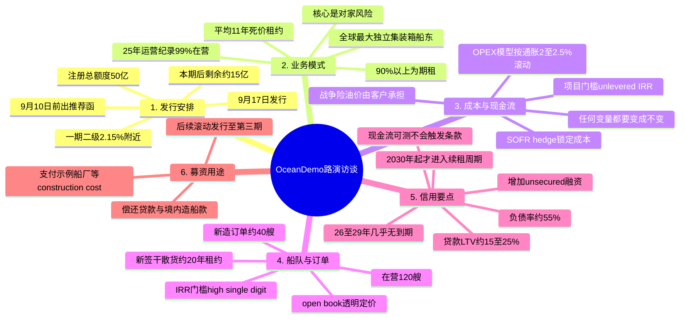

# OceanDemo 路演访谈 会议总结

> 会议时间：2026-03-10 09:06 · 时长 1:06:24 · 发言人 8 人
> 参会方：示例证券（债券销售交易部：李四、周八、郑十；债务融资总部：赵六；销售：风控部：孙七、吴九）OceanDemo 管理层（张三、王五）
> 议题：OceanDemo 第二期熊猫债（定向债务融资工具/债券通）发行推进与业务、信用交流
> 来源：飞书妙记实录（经本地音频 faster-whisper 转录交叉校对）+ 本地音频转录
> 说明：本总结仅依据会议内容整理；个别片段两套语音识别均无法辨识（已在实录中标注），不影响主体内容。

---

## 一、会议概览

本次访谈为示例证券与 OceanDemo 就第二期熊猫债发行的推进会议：示例证券方面通报了发行时间表与材料/披露要求，OceanDemo 管理层系统介绍了公司商业模式、成本与现金流管理、新造船计划及债务结构，并就信用关注点（担保结构、交叉违约、评级认知、募集资金用途、租约到期结构等）逐一回应。

## 二、发行安排与承销工作（示例证券）

- **时间表**：本期债券计划 **3 月 12 日发行**，倒推 **3 月 5 日前需出具推荐函**；上周接到通知后已在加紧推动内部流程。
- **材料要求**：券商较银行更市场化，承销及购买所需的**信息披露要求**多于银行（银行因授信合作"知根知底"要求相对少）；披露清单由专人对接。
- **第一期市场表现**：二级市场交易收益率已达 **2.15% 附近**；随着参与机构增多，流动性有望继续改善。本期发完注册额度**约剩 15 亿元**，注册总额度 **50 亿元**。
- **市场化发行前景**：随着市场化交易量积累，未来或无需提前凑足 100% 发行量，可实现纯粹市场化发行。
- **团队介绍**：销售交易部总经理李四带队，另有信评、销售、风险部同事全员参与，覆盖承销到投资全链条。

## 三、OceanDemo 业务模式

- **行业地位**：OceanDemo 是**全球最大的独立集装箱班轮船东**。班轮运输如同公交系统（定线、定期、靠港），与散货/油轮"有货才去"的运营逻辑不同，必须依托严密的组织网络。前十大班轮公司掌握全球约 **90%** 集装箱运力，前五大约占 **70%**，集中度极高。
- **航线逻辑**：中国—美国单程约 **11 周**，若维持每周一班需 **11~12 条**船；班轮公司难以自有全部运力，因此诞生了提供期租的独立船东。
- **两种租赁模式**：光租（bareboat，仅提供资产）与期租（time charter，提供船舶+全套船员与运营管理）。OceanDemo **90% 以上业务为期租**；曾与示例金租以人民币合作光租项目。
- **合同特征**：与全球前十大班轮公司普遍签订 **10 年以上期租合约，平均约 11 年，租金为死价（fixed rate）**；新造船租约通常锁定约 **12 年**收回投资。即期市场涨跌与公司收入无关。
- **风险结构**：
  - 核心风险是**对家风险（counterparty risk）**——客户不倒闭即能收到租金；十大客户历史上无违约、无弃船，前天刚有一条新船提前 107 天交付且照常接收。
  - **运营风险**：25 年 track record，**99% 以上时间船舶在运营**。
  - 战争险、油价等波动性成本**均由承租人承担**（"像给你一辆滴滴、连司机，油费风险都是你的"）；公司只对船本身投保 P&I（保赔险）与 hull（船壳险）标准险种。
- **客户为何租而不买**：班轮公司的资本开支中码头、物流、箱管等占用巨大（运力仅占其花费约 1/4），必然选择租赁，且倾向把船舶当作长期运营资产而非交易性资产——这决定了 OceanDemo 模式"越做越大、越做越强"，虽然盈利爆发力不如"低买高卖"的周期型同行，但**现金流特征天然适合债券与银行资金**。

## 四、成本管理与现金流确定性

- **成本模型**：收入固定、成本浮动的问题通过**全生命周期成本模型**管理——造船价、坞修（25 年寿命进坞 4 次左右）、零部件采购均计入模型；OPEX 模型按**通胀 2%~2.5%** 滚动 20 年测算，"滚到最后 OPEX 也没有滚上去"；规模化集中采购（所有客户共享同一采购群）形成成本优势。
- **内部回报纪律**：每个新项目设定 target return（**unlevered IRR**）；SOFR 定价下将 rate expense、staff cost、inflation 及 buffer 计入，集团层面对 SOFR 敞口做 **SOFR hedge** 锁定成本。
- **原则**："我们是很无聊的，任何变量都要变成不变"——中东局势、油价等在合同中已划由客户承担，对公司影响很小。

## 五、新造船订单与融资安排

- **船队规模**：在营船舶约 **120 艘**，在建/已订新船约 **40 艘**；2021—2024 年已累计下单约 50 艘，2024—2026 年持续追加，大规模分批交付已成常态。
- **新订单结构**：今年新签干散货船两个"包"——其一背后租约为**两家央企、约 20 年**；另一为加装重吊的散货船，租约同样约 20 年。船型虽有差异，但内核不变：**长租约、固定租金**。
- **融资环境**：国内银行缺资产（房地产受限），追逐"带租约的船舶资产"，各家银行的金租平台均在竞争此类资产，公司议价地位良好。
- **定价机制**：新造船市场透明（单船约 **1.5 亿~1.78 亿美元**），与船厂按 open book 模式算账；公司凭借规模采购与 OPEX 优势，要求 project IRR 达到 **high single digit**；客户认可是因为"OceanDemo 造船不是为了卖"。

## 六、信用关注点问答

- **杠杆与负债率**：目前负债率约 **60%**，低于绝大部分客户；若停止造船，现金流积累将使负债率快速下降，但管理层选择**维持再投资节奏**，每年有融资到期再融资，将杠杆维持在"安全健康"区间。
- **评级认知**：传统上航运被分析师与三大评级机构归入"强周期资产类"；随着供应链危机、疫情、红海事件后行业利润显现（头部班轮公司单季稳定盈利约 **10 亿美元**，上季度超 10 亿美元），评级机构对公司模式的理解在加深，已有机构上调评级/展望；公司亦在增加 **unsecured（无抵押）融资**（熊猫债+境外债），以优化债务结构。
- **担保结构与偿付顺序**：存量债务大部分（70%+）为有担保抵押贷款；无抵押债相对靠后。管理层回应：银行贷款 LTV 很低（每个项目约 20%~29%），unsecured 债权人的保障（coverage）充足；本轮发行后三年内预计滚动发行至第三期，未来三年无大额到期压力。
- **交叉违约与契约条款**：债权人设有如 **15.5%** 的指标线及保证金要求等条款。管理层回应："不存在不受控的情况"——所有现金流可预测，每条船加多少杠杆均有测算，**不会触发**相关条款；极端情形下才会触及 covenant 边界。
- **优先股与分红**：优先股今年已赎回一部分（成本较贵）；管理层提及每年现金流约 20 多亿美元、剔除相关支出后约 17 亿美元（口径以公司披露为准，访谈中英翻译存在个别歧义）。
- **30 天宽限期条款**：第一期熊猫债中已有"违约事件 30 天宽限期"表述；交易商协会有先例（此前万科案例为 15 天宽限期并实际发挥了化解作用）。

## 七、募集资金用途与租约到期结构

- **用途**：本期募集资金主要用于**偿还贷款/支付境内造船款**（示例船厂系船厂收人民币，江海船厂等收美元居多）；首发时人民币汇率偏弱，故资金"stay as 人民币"直接支付 construction cost；本次争取了灵活性，可按需换汇美元。
- **到期结构**：材料显示 **2026—2028 年租约到期占比仅约 2.1%**；管理层确认 **2029 年之前几乎没有租约到期**，2030 年起才进入续租周期，且公司具备"提前 lock-in（cover fix）"能力——提前 12 个月以上锁定续租，确保未来两三年无船只空档、现金流持续。"26—29 年若还是疯狂行情，这部分钱我们赚不到，但我们就是这么无聊的人。"
  > 对债务融资而言这不是坏事（现金流可见性强）；对股权投资者而言少了一些故事。—— 李四
  >

## 八、要点与后续跟进

- 示例证券：3 月 5 日推荐函前完成材料与披露清单对接；内部流程加急推进。
- 个别材料数据因中英翻译口径需会后核对（如 3.8 亿相关表述、30 天条款的适用范围）。
- 郑十提示：后续将对接非银投资人（纯信用、无抵押，入库与商业模式问题会问得更细）；第一期 PPN 上市后已有二级成交（部分低于票面，与市场下行有关），显示市场化机构开始认可。
- 张三结语：这个债券能发得好，"是因为债券本身能打"，不是因为（承销机构的）诉求。

---

## 附：思维导图

Mermaid 源码（支持 mermaid 的查看器可直接渲染）

